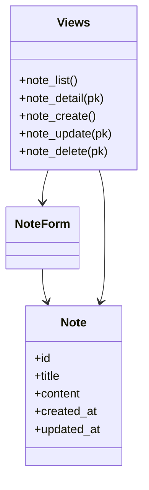

# Class Diagram — Sticky Notes

```mermaid
classDiagram
  class Note {
    +id
    +title
    +content
    +created_at
    +updated_at
  }
  class NoteForm
  class Views {
    +note_list()
    +note_detail(pk)
    +note_create()
    +note_update(pk)
    +note_delete(pk)
  }
  NoteForm --> Note
  Views --> Note
  Views --> NoteForm
```
