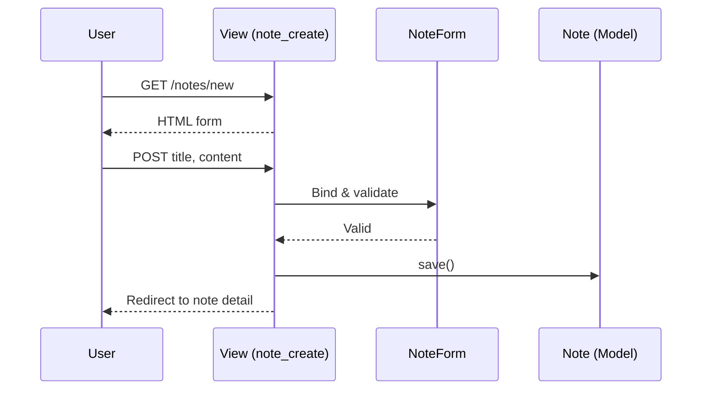

# Sequence Diagram — Create Note

```mermaid
sequenceDiagram
  participant U as User
  participant V as View (note_create)
  participant F as NoteForm
  participant M as Note (Model)

  U->>V: GET /notes/new
  V-->>U: HTML form
  U->>V: POST title, content
  V->>F: Bind & validate
  F-->>V: Valid
  V->>M: save()
  V-->>U: Redirect to note detail
```
